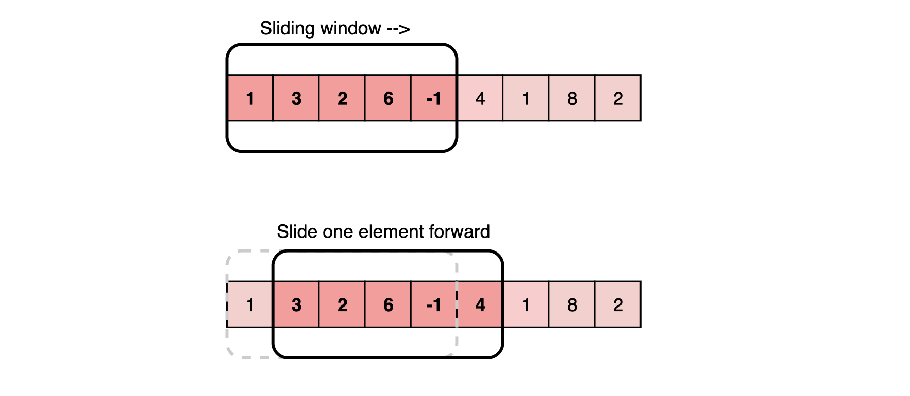
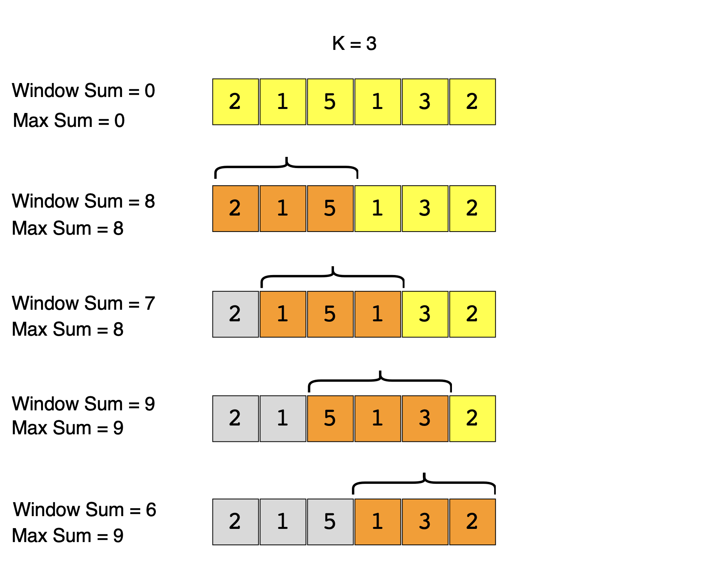
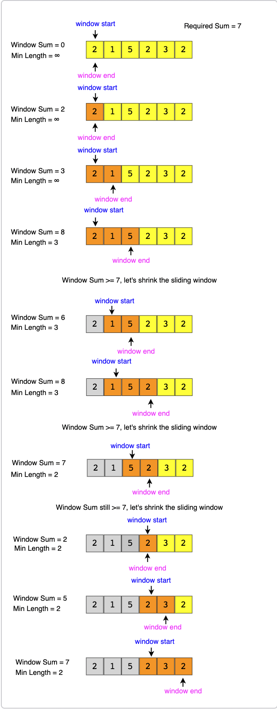
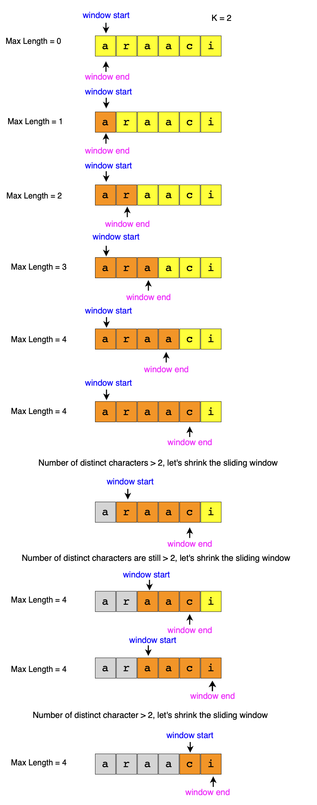

# Pattern 1: Sliding Window
In many problems dealing with an array (or a <b>LinkedList</b>), we are asked to find or calculate something among all the contiguous subarrays (or sublists) of a given size. For example, take a look at this problem:

### Find Averages of Sub Arrays
https://leetcode.com/problems/maximum-average-subarray-i/

> Given an array, find the average of all contiguous subarrays of size `K` in it.

Lets understand this problem with a real input:

`Array: [1, 3, 2, 6, -1, 4, 1, 8, 2], K=5`

A <b>brute-force</b> algorithm will calculate the sum of every 5-element contiguous subarray of the given array and divide the sum by 5 to find the average.

````java
import java.util.Arrays;
import java.util.List;

public class AverageOfSubarrays {

    public static double[] findAvgOfSubarrays(int[] arr, int K) {
        double[] results = new double[arr.length - K +1];

        for (int i = 0; i < arr.length - K + 1; i++) {
            // find sum of next 'K' elements
            double sum = 0;

            for (int j = i; j < i + K; j++) {
                sum += arr[j];
            }
            results[i] = sum / K; //calculate average
        }
        return results;
    }

    public static void main(String[] args) {
        int[] inputArray = new int[]{1, 3, 2, 6, -1, 4, 1, 8, 2};
        int subarraySize = 5;

         double[] averages = findAvgOfSubarrays(inputArray, subarraySize);

        System.out.println("Averages of subarrays: " + Arrays.toString(averages));
    }
}
````

<b>Time complexity: </b> Since for every element of the input array, we are calculating the sum of its next `K` elements, the time complexity of the above algorithm will be `O(N*K)` where `N` is the number of elements in the input array.

#### Can we find a better solution? Do you see any inefficiency in the above approach?

The inefficiency is that for any two consecutive subarrays of size `5`, the overlapping part (which will contain four elements) will be evaluated twice.

The efficient way to solve this problem would be to visualize each contiguous subarray as a <i>sliding window</i> of `5` elements. This means that we will slide the window by one element when we move on to the next subarray. To reuse the sum from the previous subarray, we will subtract the element going out of the window and add the element now being included in the <i>sliding window</i>. This will save us from going through the whole subarray to find the sum and, as a result, the algorithm complexity will reduce to `O(N)`.

Here is the algorithm for the <b>Sliding Window</b> approach:
````java
import java.util.ArrayList;
import java.util.List;

public class AveragesOfSubarrayOfSizeK {

    public static double[] findAveragesOfSubarrays(int[] arr, int k) {
        double[] results = new double[arr.length - K + 1]
        double windowSum = 0;
        int windowStart = 0;

        for (int windowEnd = 0; windowEnd < arr.length; windowEnd++) {
            // Add the next element
            windowSum += arr[windowEnd];

            // Slide the window forward
            // We don't need to slide if we have not hit the required window size of k
            if (windowEnd >= k - 1) {
                // We are automatically returning the window average once we hit the window size of k
                // and pushing to the output array
                results.add(windowSum / k);

                // Subtracting the element going out
                windowSum -= arr[windowStart];

                // Then sliding the window forward
                windowStart++;
                // Adding the element coming in, in the outer/previous loop
                // and repeating this process until we hit the end of the array
            }
        }
        return results;
    }

    public static void main(String[] args) {
        int[] inputArray = {1, 3, 2, 6, -1, 4, 1, 8, 2};
        int subarraySize = 5;

        List<Double> averages = findAveragesOfSubarrays(inputArray, subarraySize);

        System.out.println("Averages of subarrays: " + averages);
    }
}

````
## Maximum Sum Subarray of Size K (easy)
https://leetcode.com/problems/largest-subarray-length-k/
> Given an array of positive numbers and a positive number `K`, find the maximum sum of any contiguous subarray of size `K`.
### Brute Force

A basic brute force solution will be to calculate the sum of all `K` sized subarrays of the given array to find the subarray with the highest sum. We can start from every index of the given array and add the next `K` elements to find the subarrays sum.



````java
public class MaxSubarrayOfSizeK {

    public static int maxSubarrayOfSizeK(int k, int[] arr) {
        // Brute force approach
        int maxSum = 0;

        // Loop through array
        for (int i = 0; i <= arr.length - k; i++) {
            // Keep track of sum in the current window
            int windowSum = 0;

            for (int j = i; j < i + k; j++) {
                windowSum += arr[j];
            }

            // If currentWindowSum is greater than maxWindowSum, update maxWindowSum
            maxSum = Math.max(maxSum, windowSum);
        }

        return maxSum;
    }

    public static void main(String[] args) {
        System.out.println(maxSubarrayOfSizeK(3, new int[]{2, 1, 5, 1, 3, 2})); // 9
        System.out.println(maxSubarrayOfSizeK(2, new int[]{2, 3, 4, 1, 5}));    // 7
    }
}

````
- Time complexity will be `O(N*K)`, where `N` is the total number of elements in the given array

### Sliding Window Approach
If you observe closely, you will realize that to calculate the sum of a contiguous subarray, we can utilize the sum of the previous subarray. For this, consider each subarray as a <b>Sliding Window</b> of size `K`. To calculate the sum of the next subarray, we need to slide the window ahead by one element. So to slide the window forward and calculate the sum of the new position of the <i>sliding window</i>, we need to do two things:
1. Subtract the element going out of the <i>sliding window</i>, i.e., subtract the first element of the window.
2. Add the new element getting included in the <i>sliding window</i>, i.e., the element coming right after the end of the window.

This approach will save us from re-calculating the sum of the overlapping part of the <i>sliding window</i>. 
````java
public class MaxSubarrayOfSizeK {

    public static int maxSubarrayOfSizeK(int k, int[] arr) {
        // Brute force approach
        int windowSum = 0, maxSum = 0;
        int windowStart = 0;

        // Loop through array
        for (int windowEnd = 0; windowEnd < arr.length; windowEnd++) {
            windowSum += arr[windowEnd];

        if(windowEnd >= k-1) {
            maxSum = Math.max(maxSum, windowSum);
            windowSum -= arr[windowStart];
            windowStart++;
        }
      }
        return maxSum;
    }

    public static void main(String[] args) {
        System.out.println(maxSubarrayOfSizeK(3, new int[]{2, 1, 5, 1, 3, 2})); // 9
        System.out.println(maxSubarrayOfSizeK(2, new int[]{2, 3, 4, 1, 5}));    // 7
    }
}

````
- The time complexity of the above algorithm will be `O(N)`
- The space complexity of the above algorithm will be `O(1)`

## Smallest Subarray with a given sum (easy)
https://leetcode.com/problems/minimum-size-subarray-sum/
> Given an array of positive numbers and a positive number `S`, find the length of the <b>smallest contiguous subarray whose sum is greater than or equal to `S`</b>. 
> 
> Return 0 if no such subarray exists.

This problem follows the <b>Sliding Window pattern</b>, and we can use a similar strategy as discussed in <b>[Maximum Sum Subarray of Size K](#maximum-sum-subarray-of-size-k-easy)</b>. There is one difference though: in this problem, the <i>sliding window</i> size is not fixed. Here is how we will solve this problem:
1. First, we will add-up elements from the beginning of the array until their sum becomes greater than or equal to `S`.
2. These elements will constitute our <i>sliding window</i>. We are asked to find the smallest such window having a sum greater than or equal to `S`. We will remember the length of this window as the smallest window so far.
3. After this, we will keep adding one element in the <i>sliding window</i> (i.e., slide the window ahead) in a stepwise fashion.
4. In each step, we will also try to shrink the window from the beginning. We will shrink the window until the windows sum is smaller than `S` again. This is needed as we intend to find the smallest window. This shrinking will also happen in multiple steps; in each step, we will do two things:
  - Check if the current window length is the smallest so far, and if so, remember its length.
  - Subtract the first element of the window from the running sum to shrink the sliding window.





````java
public class SmallestSubarrayWithGivenSum {

    public static int smallestSubarrayWithGivenSum(int[] arr, int s) {
        int windowSum = 0, minLength = Integer.MAX_VALUE;
        int windowStart = 0;

        for (int windowEnd = 0; windowEnd < arr.length; windowEnd++) {
            windowSum += arr[windowEnd];

            while (windowSum >= s) {
                minLength = Math.min(minLength, windowEnd - windowStart + 1);
                windowSum -= arr[windowStart];
                windowStart++;
            }
        }

        return minLength == Integer.MAX_VALUE ? 0 : minLength;
    }

    public static void main(String[] args) {
        System.out.println(smallestSubarrayWithGivenSum(new int[]{2, 1, 5, 2, 3, 2}, 7)); // 2
        System.out.println(smallestSubarrayWithGivenSum(new int[]{2, 1, 5, 2, 8}, 7));    // 1
    }
    
}        

````
- The time complexity of the above algorithm will be `O(N)`. The outer for loop runs for all elements, and the inner while loop processes each element only once; therefore, the time complexity of the algorithm will be `O(N+N)`), which is asymptotically equivalent to `O(N)`.
- The algorithm runs in constant space `O(1)`.

## Longest Substring with K Distinct Characters (medium)
https://leetcode.com/problems/longest-substring-with-at-most-k-distinct-characters/

>Given a string, find the length of the <b>longest substring</b> in it with <b>no more than `K` distinct characters</b>.
>
>You can assume that `K` is less than or equal to the length of the given string.

This problem follows the <b>Sliding Window pattern</b>, and we can use a similar dynamic <i>sliding window</i> strategy as discussed in <b>[Smallest Subarray with a given sum](#smallest-subarray-with-a-given-sum-easy)</b>. We can use a <b>HashMap</b> to remember the frequency of each character we have processed. Here is how we will solve this problem:

1. First, we will insert characters from the beginning of the string until we have `K` distinct characters in the <b>HashMap</b>.
2. These characters will constitute our <i>sliding window</i>. We are asked to find the longest such window having no more than `K` distinct characters. We will remember the length of this window as the longest window so far.
3. After this, we will keep adding one character in the <i>sliding window</i> (i.e., slide the window ahead) in a stepwise fashion.
4. In each step, we will try to shrink the window from the beginning if the count of distinct characters in the <b>HashMap</b> is larger than `K`. We will shrink the window until we have no more than `K` distinct characters in the <b>HashMap</b>. This is needed as we intend to find the longest window.
5. While shrinking, well decrement the characters frequency going out of the window and remove it from the <b>HashMap</b> if its frequency becomes zero.
6. At the end of each step, well check if the current window length is the longest so far, and if so, remember its length.




````java
import java.util.HashMap;
import java.util.Map;

public class LongestSubstringWithKDistinct {

    public static int longestSubstringWithKDistinct(String str, int k) {
        if(str == null || str.length() == 0 || str.length() < k) return 0;
        
        int windowStart = 0, maxLength = 0;
        Map<Character, Integer> charFrequency = new HashMap<>();

        for (int windowEnd = 0; windowEnd < str.length(); windowEnd++) {
            char rightChar = str.charAt(windowEnd);

            charFrequency.put(rightChar, charFrequency.getOrDefault(rightChar, 0) + 1);

            while (charFrequency.size() > k) {
                char leftChar = str.charAt(windowStart);
                charFrequency.put(leftChar, charFrequency.get(leftChar) - 1);

                if (charFrequency.get(leftChar) == 0) {
                    charFrequency.remove(leftChar);
                }

                windowStart++;
            }

            maxLength = Math.max(maxLength, windowEnd - windowStart + 1);
        }

        return maxLength;
    }

    public static void main(String[] args) {
        System.out.println(longestSubstringWithKDistinct("araaci", 2)); // 4
        System.out.println(longestSubstringWithKDistinct("araaci", 1)); // 2
        System.out.println(longestSubstringWithKDistinct("cbbebi", 3)); // 5
    }
}

````
- The above algorithms time complexity will be `O(N)`, where `N` is the number of characters in the input string. The outer for loop runs for all characters, and the inner while loop processes each character only once; therefore, the time complexity of the algorithm will be `O(N+N)`, which is asymptotically equivalent to `O(N)`
- The algorithms space complexity is `O(K)`, as we will be storing a maximum of `K+1` characters in the <b>HashMap</b>.

## 🔎 Fruits into Baskets (medium)
https://leetcode.com/problems/fruit-into-baskets/

> Given an array of characters where each character represents a fruit tree, you are given <b>two baskets</b>, and your goal is to put the <b>maximum number of fruits in each basket</b>. The only restriction is that <b>each basket can have only one type of fruit</b>.
>
> You can start with any tree, but you cant skip a tree once you have started. You will pick one fruit from each tree until you cannot, i.e., you will stop when you have to pick from a third fruit type.
>
> Write a function to return the maximum number of fruits in both baskets.

This problem follows the <b>Sliding Window pattern</b> and is quite similar to <b>[Longest Substring with K Distinct Characters](#longest-substring-with-k-distinct-characters-medium)</b>. 

In this problem, we need to find the length of the longest subarray with no more than two distinct characters (or fruit types!). 

This transforms the current problem into Longest Substring with <b>K Distinct Characters</b> where `K=2`.
````java
import java.util.HashMap;
import java.util.Map;

public class Fruits {

    public static int fruitsInBaskets(char[] fruits) {
        int windowStart = 0;
        int maxLength = 0;
        Map<Character, Integer> fruitFrequency = new HashMap<>();

        // try to extend the range
        for (int windowEnd = 0; windowEnd < fruits.length; windowEnd++) {
            char endFruit = fruits[windowEnd];
            fruitFrequency.put(endFruit, fruitFrequency.getOrDefault(endFruit, 0) + 1);

            // shrink the sliding window until we are left with '2' fruits in the fruitFrequency map
            while (fruitFrequency.size() > 2) {
                char startFruit = fruits[windowStart];
                fruitFrequency.put(startFruit, fruitFrequency.get(startFruit) - 1);

                if (fruitFrequency.get(startFruit) == 0) {
                    fruitFrequency.remove(startFruit);
                }
                windowStart++;
            }

            maxLength = Math.max(maxLength, windowEnd - windowStart + 1);
        }

        return maxLength;
    }

    public static void main(String[] args) {
        System.out.println(fruitsInBaskets(new char[]{'A', 'B', 'C', 'A', 'C'})); // 3
        System.out.println(fruitsInBaskets(new char[]{'A', 'B', 'C', 'B', 'B', 'C'})); // 5
    }
}

````
- The above algorithms time complexity will be `O(N)`, where `N` is the number of characters in the input array. The outer `for` loop runs for all characters, and the inner `while` loop processes each character only once; therefore, the time complexity of the algorithm will be `O(N+N)`, which is asymptotically equivalent to `O(N)`.
- The algorithm runs in constant space `O(1)` as there can be a maximum of three types of fruits stored in the frequency map.
### Longest Substring with at most 2 distinct characters
https://leetcode.com/problems/longest-substring-with-at-most-two-distinct-characters/
> Given a string, find the length of the longest substring in it with at most two distinct characters.

````java
import java.util.HashMap;
import java.util.Map;

public class LongestSubstringTwoDistinct {

    public static int lengthOfLongestSubstringTwoDistinct(String s) {
        int windowStart = 0;
        int maxLength = 0;
        Map<Character, Integer> charFreq = new HashMap<>();

        // try to extend the range
        for (int windowEnd = 0; windowEnd < s.length(); windowEnd++) {
            char endChar = s.charAt(windowEnd);

            charFreq.put(endChar, charFreq.getOrDefault(endChar, 0) + 1);

            // shrink the sliding window until we are left
            // with 2 chars in charFreq map

            while (charFreq.size() > 2) {
                char startChar = s.charAt(windowStart);
                charFreq.put(startChar, charFreq.get(startChar) - 1);

                if (charFreq.get(startChar) == 0) {
                    charFreq.remove(startChar);
                }
                windowStart++;
            }

            maxLength = Math.max(maxLength, windowEnd - windowStart + 1);
        }

        return maxLength;
    }

    public static void main(String[] args) {
        System.out.println(lengthOfLongestSubstringTwoDistinct("eceba")); // 3
        System.out.println(lengthOfLongestSubstringTwoDistinct("ccaabbb")); // 5
    }
}

````


## No-repeat Substring (hard)
https://leetcode.com/problems/longest-substring-without-repeating-characters/

> Given a string, find the <b>length of the longest substring</b>, which has <b>no repeating characters</b>.

This problem follows the <b>Sliding Window pattern</b>, and we can use a similar dynamic <i>sliding window</i> strategy as discussed in <b>Longest Substring with K Distinct Characters</b>. We can use a <b>HashMap</b> to remember the last index of each character we have processed. Whenever we get a repeating character, we will shrink our <i>sliding window</i> to ensure that we always have distinct characters in the <i>sliding window</i>.

````java
import java.util.HashMap;
import java.util.Map;

public class NonRepeatSubstring {

    public static int nonRepeatSubstring(String str) {
        int windowStart = 0;
        int maxLength = 0;
        Map<Character, Integer> charIndexMap = new HashMap<>();
        
        // try to extend the range [windowStart, windowEnd]
        for (int windowEnd = 0; windowEnd < str.length(); windowEnd++) {
            char endChar = str.charAt(windowEnd);
            
            // if the map already contains the endChar, 
            // shrink the window from the beginning 
            // so that we only have one occurrence of endChar
            if (charIndexMap.containsKey(endChar)) {
                // this is tricky; in the current window, 
                // we will not have any endChar after
                // its previous index. and if windowStart
                // is already ahead of the last index of
                // endChar, we'll keep windowStart
                windowStart = Math.max(windowStart, charIndexMap.get(endChar) + 1);
            }
            
            // insert the endChar into the map
            charIndexMap.put(endChar, windowEnd);
            
            // remember the maximum length so far
            maxLength = Math.max(maxLength, windowEnd - windowStart + 1);
        } 
        return maxLength;
    }

    public static void main(String[] args) {
        System.out.println(nonRepeatSubstring("aabccbb")); // 3
        System.out.println(nonRepeatSubstring("abbbb"));   // 2
        System.out.println(nonRepeatSubstring("abccde"));  // 3
    }
}

````
- The above algorithms time complexity will be `O(N)`, where `N` is the number of characters in the input string.
- The algorithms space complexity will be `O(K)`, where `K` is the number of distinct characters in the input string. This also means `K<=N`, because in the worst case, the whole string might not have any repeating character, so the entire string will be added to the <b>HashMap</b>. Having said that, since we can expect a fixed set of characters in the input string (e.g., 26 for English letters), we can say that the algorithm runs in fixed space `O(1)`; in this case, we can use a fixed-size array instead of the <b>HashMap</b>.

## Longest Substring with Same Letters after Replacement (hard)
https://leetcode.com/problems/longest-repeating-character-replacement/

> Given a string with lowercase letters only, if you are allowed to <b>replace no more than `K` letters</b> with any letter, find the <b>length of the longest substring having the same letters</b> after replacement.

This problem follows the <b>Sliding Window pattern</b>, and we can use a similar dynamic <i>sliding window</i> strategy as discussed in <b>No-repeat Substring</b>. We can use a <b>HashMap</b> to count the frequency of each letter.

- We will iterate through the string to add one letter at a time in the window.
- We will also keep track of the count of the maximum repeating letter in any window (lets call it `maxRepeatLetterCount`).
- So, at any time, we know that we do have a window with one letter repeating `maxRepeatLetterCount` times; this means we should try to replace the remaining letters.
  - If the remaining letters are less than or equal to `K`, we can replace them all.
  - If we have more than `K` remaining letters, we should shrink the window as we cannot replace more than `K` letters.

While shrinking the window, we dont need to update `maxRepeatLetterCount` (hence, it represents the maximum repeating count of ANY letter for ANY window). Why dont we need to update this count when we shrink the window? Since we have to replace all the remaining letters to get the longest substring having the same letter in any window, we cant get a better answer from any other window even though all occurrences of the letter with frequency `maxRepeatLetterCount` is not in the current window.
````java
import java.util.HashMap;
import java.util.Map;

public class LongestSubstring {

    public static int lengthOfLongestSubstring(String str, int k) {
        int windowStart = 0;
        int maxLength = 0;
        int maxRepeatLetterCount = 0;
        Map<Character, Integer> charFrequency = new HashMap<>();

        // Try to extend the range [windowStart, windowEnd]
        for (int windowEnd = 0; windowEnd < str.length(); windowEnd++) {
            char endChar = str.charAt(windowEnd);

            charFrequency.put(endChar, charFrequency.getOrDefault(endChar, 0) + 1);
            maxRepeatLetterCount = Math.max(maxRepeatLetterCount, charFrequency.get(endChar));

            // Current window size is from windowStart to windowEnd.
            // Overall we have a letter which is repeating maxRepeatLetterCount times.
            // This means we can have a window which has one letter repeating maxRepeatLetterCount times,
            // and the remaining letters we should replace.
            // If the remaining letters are more than k, it is the time to shrink the window,
            // as we are not allowed to replace more than k letters.
            if ((windowEnd - windowStart + 1 - maxRepeatLetterCount) > k) {
                char startChar = str.charAt(windowStart);
                charFrequency.put(startChar, charFrequency.get(startChar) - 1);
                windowStart++;
            }

            maxLength = Math.max(maxLength, windowEnd - windowStart + 1);
        }
        return maxLength;
    }

    public static void main(String[] args) {
        System.out.println(lengthOfLongestSubstring("aabccbb", 2)); // 5
        System.out.println(lengthOfLongestSubstring("abbcb", 1));   // 4
        System.out.println(lengthOfLongestSubstring("abccde", 1));  // 3
    }
}

````

- The above algorithms time complexity will be `O(N)`, where `N` is the number of letters in the input string.
- As we expect only the lower case letters in the input string, we can conclude that the space complexity will be `O(26)` to store each letters frequency in the <b>HashMap</b>, which is asymptotically equal to `O(1)`.

## Longest Subarray with Ones after Replacement (hard)
https://leetcode.com/problems/max-consecutive-ones-iii/

> Given an array containing `0`'s and `1`'s, if you are allowed to <b>replace no more than `K` `0`'s with `1`'s</b>, 
> find the length of the <b>longest contiguous subarray having all `1`'s</b>.

This problem follows the <b>Sliding Window pattern</b> and is quite similar to <b>Longest Substring with same Letters after Replacement</b>. The only difference is that, in the problem, we only have two characters (`1`'s and `0`'s) in the input arrays.

Following a similar approach, well iterate through the array to add one number at a time in the window. Well also keep track of the maximum number of repeating `1`'s in the current window (lets call it `maxOnesCount`). So at any time, we know that we can have a window with `1`'s repeating `maxOnesCount` time, so we should try to replace the remaining `0`'s. If we have more than `K` remaining `0`'s, we should shrink the window as we are not allowed to replace more than `K` `0`'s.

````js
function lengthOfLongestSubstring (arr, k) {
  let windowStart = 0
  let maxLength = 0
  let maxOnesCount = 0
  
  //Try to extend the range [windowStart, windowEnd]
  for(let windowEnd = 0; windowEnd < arr.length; windowEnd++) {
    if(arr[windowEnd] === 1) {
      maxOnesCount++
    }
    
    //current window size is from windowStart to windowEnd, overall we have a 
    //maximum of `1`'s repeating maxOnesCount times, this means we can have a window 
    //with maxOnesCount `1`'s and the remaining are `0`'s which should replace with `1`'s
    //now, if the remaining `0`'s are more that k, it is the time to shrink the 
    //window as we are not allowed to replace more than k `0`'s
    if((windowEnd - windowStart + 1 - maxOnesCount) > k) {
      if(arr[windowStart] === 1) {
        maxOnesCount--
      }
      windowStart++
    }
    
    maxLength = Math.max(maxLength, windowEnd - windowStart + 1)
  }
  
  return maxLength  
}

lengthOfLongestSubstring ([0, 1, 1, 0, 0, 0, 1, 1, 0, 1, 1], 2)//6, Replace the '0' at index 5 and 8 to have the longest contiguous subarray of `1`'s having length 6.
lengthOfLongestSubstring ([0, 1, 0, 0, 1, 1, 0, 1, 1, 0, 0, 1, 1], 3)//9, Replace the '0' at index 6, 9, and 10 to have the longest contiguous subarray of `1`'s having length 9.
````
- The above algorithms time complexity will be `O(N)`, where `N` is the count of numbers in the input array.
- The algorithm runs in constant space `O(1)`.

## 🌟 Permutation in a String (hard)
https://leetcode.com/problems/permutation-in-string/

> Given a string and a pattern, find out if the <b>string contains any permutation of the pattern</b>.

<b>Permutation</b> is defined as the re-arranging of the characters of the string. For example, `“abc”` has the following six permutations:
- abc
- acb
- bac
- bca
- cab
- cba

If a string has `n` distinct characters, it will have `n!` permutations.

This problem follows the <b>Sliding Window pattern</b>, and we can use a similar <i>sliding window</i> strategy as discussed in <b>[Longest Substring with K Distinct Characters](#longest-substring-with-k-distinct-characters-medium)</b>. We can use a <b>HashMap</b> to remember the frequencies of all characters in the given pattern. Our goal will be to match all the characters from this <b>HashMap</b> with a<i>sliding window</i>in the given string. Here are the steps of our algorithm:
- Create a <b>HashMap</b> to calculate the frequencies of all characters in the pattern.
- Iterate through the string, adding one character at a time in the <i>sliding window</i>.
- If the character being added matches a character in the <b>HashMap</b>, decrement its frequency in the map. If the character frequency becomes zero, we got a complete match.
- If at any time, the number of characters matched is equal to the number of distinct characters in the pattern (i.e., total characters in the <b>HashMap</b>), we have gotten our required permutation.
- If the window size is greater than the length of the pattern, shrink the window to make it equal to the patterns size. At the same time, if the character going out was part of the pattern, put it back in the frequency <b>HashMap</b>.

````js
function findPermutation(str, pattern) {
  //sliding window
  let windowStart = 0
  let isMatch = 0
  let charFrequency = {}
  
 for(i = 0; i < pattern.length; i++) {
   const char = pattern[i]
   if(!(char in charFrequency)) {
     charFrequency[char] = 0
   }
   charFrequency[char]++
 }
  
  //our goal is to math all the characters from charFrequency with the current window
  //try to extend the range [windowStart, windowEnd]
  for(windowEnd = 0; windowEnd < str.length; windowEnd++) {
    const endChar = str[windowEnd]
    if(endChar in charFrequency) {
      //decrement the frequency of the matched character
      charFrequency[endChar]--
      if(charFrequency[endChar] === 0) {
        isMatch++
      }
    }
    if(isMatch === Object.keys(charFrequency).length) {
      return true
    }
    
    //shrink the sliding window
    if(windowEnd >= pattern.length - 1) {
      let startChar = str[windowStart]
      windowStart++
      if(startChar in charFrequency) {
        if(charFrequency[startChar] === 0) {
          isMatch--
        }
        charFrequency[startChar]++
      }
    }
  }
  return false
}

findPermutation("oidbcaf", "abc")//true, The string contains "bca" which is a permutation of the given pattern.
findPermutation("odicf", "dc")//false
findPermutation("bcdxabcdy", "bcdxabcdy")//true
findPermutation("aaacb", "abc")//true, The string contains "acb" which is a permutation of the given pattern.
````

- The above algorithms time complexity will be `O(N + M)`, where `N` and `M` are the number of characters in the input string and the pattern, respectively.
- The algorithms space complexity is `O(M)` since, in the worst case, the whole pattern can have distinct characters that will go into the <b>HashMap</b>.

## 🌟 String Anagrams (hard)
https://leetcode.com/problems/find-all-anagrams-in-a-string/

> Given a string and a pattern, <b>find all anagrams of the pattern in the given string</b>.

Every <b>anagram</b> is a <b>permutation</b> of a string. 

As we know, when we are not allowed to repeat characters while finding permutations of a string, we get `N!` permutations (or anagrams) of a string having `N` characters. For example, here are the six anagrams of the string `“abc”`:
- abc
- acb
- bac
- bca
- cab
- cba

> Write a function to return a list of starting indices of the anagrams of the pattern in the given string.

This problem follows the <b>Sliding Window pattern</b> and is very similar to <b>Permutation in a String</b>. In this problem, we need to find every occurrence of any permutation of the pattern in the string. We will use a list to store the starting indices of the anagrams of the pattern in the string.
````js
function findStringAnagrams(str, pattern){
  let windowStart = 0, matched = 0, charFreq = {}
  
  for(let i = 0; i < pattern.length; i++){
    const char = pattern[i]
    if(!(char in charFreq)) {
      charFreq[char] = 0
    }
    charFreq[char]++
  }
  const resultIndex = []
  
  //our goal is to match all the characters from the charFreq
  //with the current window try to 
  //extend the range [windowStart, windowEnd]
  for(let windowEnd = 0; windowEnd < str.length; windowEnd++) {
    const endChar = str[windowEnd]
    if(endChar in charFreq) {
      //decrement the frequency of matched character
      charFreq[endChar]--
      if(charFreq[endChar] === 0) {
        matched++
      }
    }
    
    if(matched === Object.keys(charFreq).length){
      //have we found an anagram
      resultIndex.push(windowStart)
    }
    
    //shrink the sliding window
    if(windowEnd >= pattern.length -1) {
      const startChar = str[windowStart]
      windowStart++
      if(endChar in charFreq) {
        if(charFreq[startChar] === 0) {
          //before putting the character back
          //decrement the matched count
          matched--
        }
        //put the character back
        charFreq[startChar]++
      }
    }
  }
  
  return resultIndex
}

findStringAnagrams('ppqp', 'pq')//[1,2], The two anagrams of the pattern in the given string are "pq" and "qp".
findStringAnagrams('abbcabc', 'abc')//[2,3,4], The three anagrams of the pattern in the given string are "bca", "cab", and "abc".
````

- The time complexity of the above algorithm will be `O(N + M)` where `N` and `M` are the number of characters in the input string and the pattern respectively.
- The space complexity of the algorithm is `O(M)` since in the worst case, the whole pattern can have distinct characters which will go into the <b>HashMap</b>. In the worst case, we also need `O(N)` space for the result list, this will happen when the pattern has only one character and the string contains only that character.

## 🌟 Smallest Window containing Substring (hard)
https://leetcode.com/problems/minimum-window-substring/

> Given a string and a pattern, find the <b>smallest substring</b> in the given string which has <b>all the characters of the given pattern</b>.

This problem follows the <b>Sliding Window pattern</b> and has a lot of similarities with <b>Permutation in a String</b> with one difference. In this problem, we need to find a substring having all characters of the pattern which means that the required substring can have some additional characters and doesnt need to be a permutation of the pattern. Here is how we will manage these differences:
1. We will keep a running count of every matching instance of a character.
2. Whenever we have matched all the characters, we will try to shrink the window from the beginning, keeping track of the smallest substring that has all the matching characters.
3. We will stop the shrinking process as soon as we remove a matched character from the <i>sliding window</i>. One thing to note here is that we could have redundant matching characters, e.g., we might have two a in the <i>sliding window</i> when we only need one a. In that case, when we encounter the first a, we will simply shrink the window without decrementing the matched count. We will decrement the matched count when the second a goes out of the window.

````js
function findSubstring(str, pattern) {
  let windowStart = 0
  let matched = 0
  let substrStart = 0
  let minLength = str.length + 1
  let charFreq = {}
  
  for(let i = 0; i < pattern.length; i++) {
    const char = pattern[i]
    if(!(char in charFreq)) {
      charFreq[char] = 0
    }
    charFreq[char]++
  }
  
  //try to extend the range [windowStart, windowEnd]
  for(let windowEnd = 0; windowEnd < str.length; windowEnd++) {
    const endChar = str[windowEnd]
    if(endChar in charFreq) {
      charFreq[endChar]--
      if(charFreq[endChar] >= 0) {
        //count every matching of a character
        matched++
      }
    }
    
    //Shrink the window if we can, finish as soon as we remove a 
    //matched character
    while(matched === pattern.length) {
      if(minLength > windowEnd - windowStart + 1) {
        minLength = windowEnd - windowStart + 1
        substrStart = windowStart
      }
      
      const startChar = str[windowStart]
      windowStart++
      if(startChar in charFreq) {
        if(charFreq[startChar] === 0) {
        matched--
      }
      charFreq[startChar]++
        
      }
    }
  } 
  if(minLength > str.length) {
  return ''
}
return str.substring(substrStart, substrStart + minLength)
}

findSubstring("aabdec", "abc")//"abdec", The smallest substring having all characters of the pattern is "abdec"
findSubstring("abdbca", "abc")//"bca", The smallest substring having all characters of the pattern is "bca".
findSubstring("adcad", "abc")//"", No substring in the given string has all characters of the pattern.
````

- The time complexity of the above algorithm will be `O(N + M)` where `N` and `M` are the number of characters in the input string and the pattern respectively.
- The space complexity of the algorithm is `O(M)` since in the worst case, the whole pattern can have distinct characters which will go into the <b>HashMap</b>. In the worst case, we also need `O(N)` space for the resulting substring, which will happen when the input string is a permutation of the pattern.
## 🌟 Words Concatenation (hard)
https://leetcode.com/problems/substring-with-concatenation-of-all-words/

Given a string and a list of `words`, find all the starting indices of substrings in the given string that are a <b>concatenation of all the given `words`</b> exactly once without any <b>overlapping of `words`</b>. It is given that all `words` are of the same length.

This problem follows the <b>Sliding Window pattern</b> and has a lot of similarities with <b>[Maximum Sum Subarray of Size K](#maximum-sum-subarray-of-size-k-easy)</b>. We will keep track of all the `words` in a <b>HashMap</b> and try to match them in the given string. Here are the set of steps for our algorithm:
1. Keep the frequency of every word in a <b>HashMap</b>.
2. Starting from every index in the string, try to match all the `words`.
3. In each iteration, keep track of all the `words` that we have already seen in another <b>HashMap</b>.
4. If a word is not found or has a higher frequency than required, we can move on to the next character in the string.
5. Store the index if we have found all the `words`.

````js
function findWordConcatenation(str, words) {
  if(words.length === 0 || words[0].length === 0) {
    return []
  }
  
  let wordFreq = {}
  
  words.forEach((word) => {
    if(!(word in wordFreq)) {
      wordFreq[word] = 0
    }
    wordFreq[word]++
  })
  
  const resultIndex = []
  let wordCount = words.length
  let wordLength = words[0].length

  for(let i = 0; i < (str.length - wordCount * wordLength) + 1; i++) {
    const wordsSeen = {}
    for(let j = 0; j < wordCount; j++) {
      let nextWordIndex = i + j * wordLength
      //get the next word from the string
      const word = str.substring(nextWordIndex, nextWordIndex + wordLength)
      if(!(word in wordFreq)){
        //break if we don't need this word
        break
      }
      
      //add the word ot the wordsSeen ma
      if(!(word in wordsSeen)){
        wordsSeen[word] = 0
      }
      wordsSeen[word]++
      
      //no need to process furrther if the word
      //has higher frequency than required
      if(wordsSeen[word] > (wordFreq[word] || 0)){
        break
      }
      
      if(j + 1 === wordCount){
        //store index if we have found all the words
        resultIndex.push(i)
      }
    }
  }
  return resultIndex
}

findWordConcatenation("catfoxcat", ["cat", "fox"])//[0, 3], The two substring containing both the words are "catfox" & "foxcat".
findWordConcatenation("catcatfoxfox", ["cat", "fox"])//[3], The only substring containing both the words is "catfox".
````
- The time complexity of the above algorithm will be `O(N * M * Len)` where `N` is the number of characters in the given string, `M` is the total number of `words`, and `Len` is the length of a word.
- The space complexity of the algorithm is `O(M)` since at most, we will be storing all the `words` in the two <b>HashMaps</b>. In the worst case, we also need `O(N)` space for the resulting list. So, the overall space complexity of the algorithm will be `O(M+N)`.

