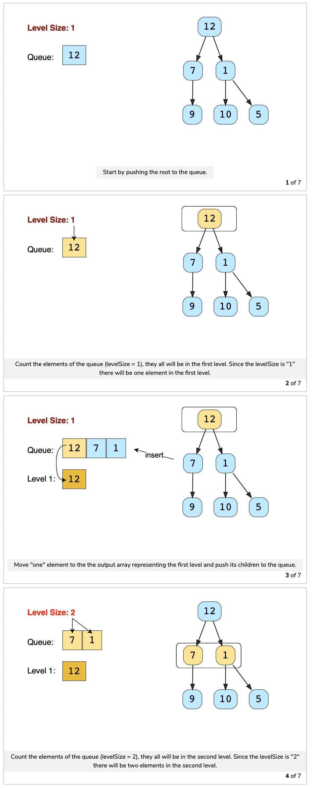
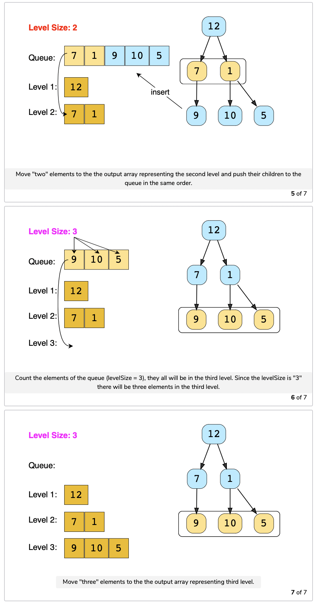

# Pattern 7: Tree Breadth First Search

This pattern is based on the <b>Breadth First Search (BFS)</b> technique to traverse a tree.

Any problem involving the traversal of a tree in a level-by-level order can be efficiently solved using this approach. We will use a <b>Queue</b> to keep track of all the nodes of a level before we jump onto the next level. This also means that the space complexity of the algorithm will be `O(W)`, where `W` is the maximum number of nodes on any level.


## Binary Tree Level Order Traversal (easy)
https://leetcode.com/problems/binary-tree-level-order-traversal/

> Given a binary tree, populate an array to represent its level-by-level traversal. You should populate the values of all <b>nodes of each level from left to right</b> in separate sub-arrays.

Since we need to traverse all nodes of each level before moving onto the next level, we can use the <b>Breadth First Search (BFS)</b> technique to solve this problem.

We can use a <b>Queue</b> to efficiently traverse in <b>BFS</b> fashion. Here are the steps of our algorithm:
1. Start by pushing the `root` node to the queue.
2. Keep iterating until the <b>queue</b> is empty.
3. In each iteration, first count the elements in the <b>queue</b> (let’s call it `levelSize`). We will have these many nodes in the current level.
4. Next, remove `levelSize` nodes from the <b>queue</b> and push their `value` in an array to represent the current level.
5. After removing each node from the queue, insert both of its children into the queue.
6. If the <b>queue</b> is not empty, repeat from <i>step 3</i> for the next level.




````java
import java.util.*;

class TreeNode {
    int val;
    TreeNode left;
    TreeNode right;
    
    TreeNode(int x){
        val = x;
    }
}

class LevelOrderTraversal{
    public static List<List<Integer>> traverse(TreeNode root){
        List<List<Integer>> result = new ArrayList<List<Integer>>();
        if(root == null) return result;
        
        Queue<TreeNode> queue = new LinkedList<>();
        queue.offer(root);
        
        while(!queue.isEmpty()){
            int levelSize = queue.size();
            List<Integer> currentLevel = new ArrayList<>(levelSize);
            for(int i =0; i< levelSize; i++){
                TreeNode currentNode = queue.poll();
                //adding the node to the current level
                currentLevel.add(currentNode.val);
                if(currentNode.left != null)   queue.offer(currentNode.left);
                if(currentNode.right != null)   queue.offer(currentNode.right);
            }
            result.add(currentLevel);
        }
        return result;
        
    }
    
    
    public static void main(String[] args){
        
        TreeNode root = new TreeNode(12);
        root.left = new TreeNode(7);
        root.right = new TreeNode(1);
        root.left.left =  new TreeNode(9);
        root.right.left =  new TreeNode(10);
        root.right.right =  new TreeNode(5);
        List<List<Integer>> result = LevelOrderTraversal.traverse(root);
        System.out.println("Level order traversal: " + result);
    }
}
````

- The time complexity of the above algorithm is `O(N)`, where `N` is the total number of nodes in the tree. This is due to the fact that we traverse each node once.
- The space complexity of the above algorithm will be `O(N)` as we need to return a list containing the level order traversal. We will also need `O(N)` space for the queue. Since we can have a maximum of `N/2` nodes at any level (this could happen only at the lowest level), therefore we will need `O(N)` space to store them in the queue.


## Reverse Level Order Traversal (easy)
https://leetcode.com/problems/binary-tree-level-order-traversal-ii/
> Given a binary tree, populate an array to represent its level-by-level traversal in reverse order, i.e., <b>the lowest level comes first</b>. You should populate the values of all nodes in each level from left to right in separate sub-arrays.

This problem follows the <b>Binary Tree Level Order Traversal</b> pattern. We can follow the same <b>BFS</b> approach. The only difference will be that instead of appending the current level at the end, we will append the current level at the beginning of the result list.

Here is what our algorithm will look like; only the highlighted lines have changed. Please note that, for Java, we will use a LinkedList instead of an ArrayList for our result list. As in the case of ArrayList, appending an element at the beginning means shifting all the existing elements. Since we need to append the level array at the beginning of the result list, a LinkedList will be better, as this shifting of elements is not required in a LinkedList.
  
````java

import java.util.*;

class TreeNode {
    int val;
    TreeNode left;
    TreeNode right;
    
    TreeNode(int x){
        val = x;
    }
}

class LevelOrderTraversal{
    public static List<List<Integer>> traverse(TreeNode root){
        List<List<Integer>> result = new LinkedList<List<Integer>>();
        if(root == null) return result;
        
        Queue<TreeNode> queue = new LinkedList<>();
        queue.offer(root);
        
        while(!queue.isEmpty()){
            int levelSize = queue.size();
            List<Integer> currentLevel = new ArrayList<>(levelSize);
            for(int i =0; i< levelSize; i++){
                TreeNode currentNode = queue.poll();
                //adding the node to the current level
                currentLevel.add(currentNode.val);
                if(currentNode.left != null)   queue.offer(currentNode.left);
                if(currentNode.right != null)   queue.offer(currentNode.right);
            }
            result.add(0,currentLevel);
        }
        return result;
        
    }
    
    
    public static void main(String[] args){
        
        TreeNode root = new TreeNode(12);
        root.left = new TreeNode(7);
        root.right = new TreeNode(1);
        root.left.left =  new TreeNode(9);
        root.right.left =  new TreeNode(10);
        root.right.right =  new TreeNode(5);
        List<List<Integer>> result = LevelOrderTraversal.traverse(root);
        System.out.println("Level order traversal: " + result);
    }
}
````
- The time complexity of the above algorithm is `O(N)`, where `N` is the total number of nodes in the tree. This is due to the fact that we traverse each node once.
- The space complexity of the above algorithm will be `O(N)` as we need to return a list containing the level order traversal. We will also need `O(N)` space for the queue. Since we can have a maximum of `N/2` nodes at any level (this could happen only at the lowest level), therefore we will need `O(N)` space to store them in the queue.

## 🌴 Zigzag Traversal (medium)
https://leetcode.com/problems/binary-tree-zigzag-level-order-traversal/

> Given a binary tree, populate an array to represent its zigzag level order traversal. You should populate the values of all <b>nodes of the first level from left to right</b>, then <b>right to left for the next level</b> and keep alternating in the same manner for the following levels.

This problem follows the <b>Binary Tree Level Order Traversal</b> pattern. We can follow the same <b>BFS</b> approach. The only additional step we have to keep in mind is to alternate the level order traversal, which means that for every other level, we will traverse similar to <b>[Reverse Level Order Traversal](#reverse-level-order-traversal-easy)</b>.


````java
import java.util.*;

class TreeNode {
    int val;
    TreeNode left;
    TreeNode right;
    
    TreeNode(int x){
        val = x;
    }
}

class LevelOrderTraversal{
    public static List<List<Integer>> traverse(TreeNode root){
        List<List<Integer>> result = new ArrayList<List<Integer>>();
        if(root == null) return result;
        
        Queue<TreeNode> queue = new LinkedList<>();
        queue.offer(root);
        boolean leftToRight = true;
        while(!queue.isEmpty()){
            int levelSize = queue.size();
            List<Integer> currentLevel = new LinkedList<>();
            for(int i =0; i< levelSize; i++){
                TreeNode currentNode = queue.poll();
                //adding the node to the current level
                if(leftToRight) {
                     currentLevel.add(currentNode.val);
                    
                } else {
                    currentLevel.add(0,currentNode.val);
                }
                if(currentNode.left != null)   queue.offer(currentNode.left);
                if(currentNode.right != null)   queue.offer(currentNode.right);
            }
            result.add(currentLevel);
            leftToRight = !leftToRight;
        }
        return result;
        
    }
    
    
    public static void main(String[] args){
        
        TreeNode root = new TreeNode(12);
        root.left = new TreeNode(7);
        root.right = new TreeNode(1);
        root.left.left =  new TreeNode(9);
        root.right.left =  new TreeNode(10);
        root.right.right =  new TreeNode(5);
        root.right.left.left = new TreeNode(20);
        root.right.left.right = new TreeNode(17);
        List<List<Integer>> result = LevelOrderTraversal.traverse(root);
        System.out.println("Level order traversal: " + result);
    }
}
````
- The time complexity of the above algorithm is `O(N)`, where `N` is the total number of nodes in the tree. This is due to the fact that we traverse each node once.
- The space complexity of the above algorithm will be `O(N)` as we need to return a list containing the level order traversal. We will also need `O(N)` space for the queue. Since we can have a maximum of `N/2` nodes at any level (this could happen only at the lowest level), therefore we will need `O(N)` space to store them in the queue.

## Level Averages in a Binary Tree (easy)
https://leetcode.com/problems/average-of-levels-in-binary-tree/

> Given a binary tree, populate an array to represent the <b>averages of all of its levels</b>

This problem follows the <b>Binary Tree Level Order Traversal</b> pattern. We can follow the same <b>BFS</b> approach. The only difference will be that instead of keeping track of all nodes of a level, we will only track the running sum of the values of all nodes in each level. In the end, we will append the average of the current level to the result array.

````java
// Online Java Compiler
// Use this editor to write, compile and run your Java code online
import java.util.*;

class TreeNode {
    int val;
    TreeNode left;
    TreeNode right;
    
    TreeNode(int x){
        val = x;
    }
}

class LevelOrderTraversal{
    public static List<Double> averageOfLevels(TreeNode root){
        List<Double> result = new ArrayList<>();
        if(root == null) return result;

        Queue<TreeNode> queue = new LinkedList<>();
        queue.offer(root);
       
        while(!queue.isEmpty()){
            int levelSize = queue.size();
             double levelSum = 0;
            for(int i =0; i<levelSize; i++){
                TreeNode currentNode = queue.poll();
                levelSum += currentNode.val;

                if(currentNode.left != null) queue.offer(currentNode.left);
                if(currentNode.right != null) queue.offer(currentNode.right);
            }
            result.add(levelSum / levelSize );
        }
        return result;
        
    }
    
    
    public static void main(String[] args){
        
        TreeNode root = new TreeNode(12);
        root.left = new TreeNode(7);
        root.right = new TreeNode(1);
        root.left.left =  new TreeNode(9);
        root.right.left =  new TreeNode(10);
        root.right.right =  new TreeNode(5);
        root.right.left.left = new TreeNode(20);
        root.right.left.right = new TreeNode(17);
        List<Double> result = LevelOrderTraversal.averageOfLevels(root);
        System.out.println("Level Average: " + result);
    }
}
````
- The time complexity of the above algorithm is `O(N)`, where `N` is the total number of nodes in the tree. This is due to the fact that we traverse each node once.
- The space complexity of the above algorithm will be `O(N)` which is required for the queue. Since we can have a maximum of `N/2` nodes at any level (this could happen only at the lowest level), therefore we will need `O(N)` space to store them in the queue

### Level Maximum in a Binary Tree 
https://leetcode.com/problems/maximum-level-sum-of-a-binary-tree/
> 🌟  Return the smallest level x such that the sum of all the values of nodes at level x is maximal.

We will follow a similar approach, but instead of having a running sum we will track the maximum sum value of each level and store the level.


````java
import java.util.*;

class TreeNode {
    int val;
    TreeNode left;
    TreeNode right;
    
    TreeNode(int x){
        val = x;
    }
}

class LevelOrderTraversal{
    public static int averageOfLevels(TreeNode root){
        int result = 0;
        int maxSum = Integer.MIN_VALUE;

        Queue<TreeNode> queue = new LinkedList<>();
        queue.offer(root);
        int level = 1;

        while (!queue.isEmpty()) {
            int levelSize = queue.size();
            int levelSum = 0;

            for (int i = 0; i < levelSize; i++) {
                TreeNode currentNode = queue.poll();
                levelSum += currentNode.val;

                if (currentNode.left != null) queue.offer(currentNode.left);
                if (currentNode.right != null) queue.offer(currentNode.right);
            }

            if (levelSum > maxSum) {
                result = level;
                maxSum = levelSum;
            }

            level++;
        }

        return result;
        
    }
    
    
    public static void main(String[] args){
        
        TreeNode root = new TreeNode(12);
        root.left = new TreeNode(7);
        root.right = new TreeNode(1);
        root.left.left =  new TreeNode(9);
        root.right.left =  new TreeNode(10);
        root.right.right =  new TreeNode(5);
        root.right.left.left = new TreeNode(20);
        root.right.left.right = new TreeNode(17);
        int result = LevelOrderTraversal.averageOfLevels(root);
        System.out.println("Level Average: " + result);
    }
}
````
- The time complexity of the above algorithm is `O(N)`, where `N` is the total number of nodes in the tree. This is due to the fact that we traverse each node once.
- The space complexity of the above algorithm will be `O(N)` which is required for the queue. Since we can have a maximum of `N/2` nodes at any level (this could happen only at the lowest level), therefore we will need `O(N)` space to store them in the queue.

### Maximum Depth of a Binary Tree
https://leetcode.com/problems/maximum-depth-of-binary-tree/
> Given a binary tree, find its maximum depth (or height).

We will follow a similar approach. Instead of returning as soon as we find a leaf node, we will keep traversing for all the levels, incrementing `maximumDepth` each time we complete a level. 
````java
// Online Java Compiler
// Use this editor to write, compile and run your Java code online
import java.util.*;

class TreeNode {
    int val;
    TreeNode left;
    TreeNode right;
    
    TreeNode(int x){
        val = x;
    }
}

class LevelOrderTraversal{
    public static int maxDepth(TreeNode root){
              if(root == null) return 0;

      Queue<TreeNode> queue = new LinkedList<>();
      queue.add(root);
      int maxDepth = 0;
      while(!queue.isEmpty()){
            maxDepth++;
            int levelSize = queue.size();
            
            for(int i =0; i<levelSize; i++){
                TreeNode currentNode = queue.poll();
                
                // Add non-null children to the queue
                if(currentNode.left != null) queue.add(currentNode.left);
                if(currentNode.right != null) queue.add(currentNode.right);
            }
        }
        return maxDepth;
        
    }
    
    
    public static void main(String[] args){
        
        TreeNode root = new TreeNode(12);
        root.left = new TreeNode(7);
        root.right = new TreeNode(1);
        root.left.left =  new TreeNode(9);
        root.right.left =  new TreeNode(10);
        root.right.right =  new TreeNode(5);
        root.right.left.left = new TreeNode(20);
        root.right.left.right = new TreeNode(17);
        int result = LevelOrderTraversal.maxDepth(root);
        System.out.println("Level Max Depth: " + result);
    }
}
````
## Level Order Successor (easy) 
> Given a binary tree and a node, find the level order successor of the given node in the tree. The level order successor is the node that appears right after the given node in the level order traversal.

This problem follows the <b>Binary Tree Level Order Traversal</b> pattern. We can follow the same <b>BFS</b> approach. The only difference will be that we will not keep track of all the levels. Instead we will keep inserting child nodes to the queue. As soon as we find the given node, we will return the next node from the <b>queue</b> as the level order successor.

````java
import java.util.*;

class TreeNode {
    int val;
    TreeNode left;
    TreeNode right;
    
    TreeNode(int x){
        val = x;
    }
}

class LevelOrderTraversal{
    public static TreeNode findSuccesor(TreeNode root, int key){
        if(root == null) return null;

      Queue<TreeNode> queue = new LinkedList<>();
      queue.add(root);

      while(!queue.isEmpty()){
            TreeNode currentNode = queue.poll();
            // Add non-null children to the queue
            if(currentNode.left != null) queue.add(currentNode.left);
            if(currentNode.right != null) queue.add(currentNode.right);
            
            if(currentNode.val == key) break;
        }
        return queue.peek();
        
    }
    
    
    public static void main(String[] args){
        
        TreeNode root = new TreeNode(12);
        root.left = new TreeNode(7);
        root.right = new TreeNode(1);
        root.left.left =  new TreeNode(9);
        root.right.left =  new TreeNode(10);
        root.right.right =  new TreeNode(5);
        root.right.left.left = new TreeNode(20);
        root.right.left.right = new TreeNode(17);
        TreeNode result = LevelOrderTraversal.findSuccesor(root,9);
        System.out.println("Level Succesor: " + result.val);
    }
}

````

- The time complexity of the above algorithm is `O(N)`, where `N` is the total number of nodes in the tree. This is due to the fact that we traverse each node once.
- The space complexity of the above algorithm will be `O(N)` which is required for the queue. Since we can have a maximum of `N/2` nodes at any level (this could happen only at the lowest level), therefore we will need `O(N)` space to store them in the queue.

## 😕 Connect Level Order Siblings (medium)
https://leetcode.com/problems/populating-next-right-pointers-in-each-node/
> Given a binary tree, connect each node with its level order successor. The last node of each level should point to a `null` node.

This problem follows the <b>Binary Tree Level Order Traversal</b> pattern. We can follow the same <b>BFS</b> approach. The only difference is that while traversing a level we will remember the previous node to connect it with the current node.
````java

class Solution {
    public Node connect(Node root) {
        if(root == null) return null;

        Queue<Node> queue = new LinkedList<>();
        queue.offer(root);
        while(!queue.isEmpty()){
            Node previousNode = null;
            int levelSize = queue.size();
           
            for(int i =0; i<levelSize; i++){
                Node currentNode = queue.poll();
                if(previousNode != null) previousNode.next = currentNode;
                previousNode = currentNode;


                if(currentNode.left != null) queue.offer(currentNode.left);
                if(currentNode.right != null) queue.offer(currentNode.right);
            }
            
        }
        return root;  
    }
}
````
- The time complexity of the above algorithm is `O(N)`, where `N` is the total number of nodes in the tree. This is due to the fact that we traverse each node once.
- The space complexity of the above algorithm will be `O(N)`, which is required for the queue. Since we can have a maximum of `N/2`nodes at any level (this could happen only at the lowest level), therefore we will need `O(N)` space to store them in the queue.

## 🌟 Connect All Level Order Siblings (medium) 
> Given a binary tree, connect each node with its level order successor. The last node of each level should point to the first node of the next level.

This problem follows the <b>Binary Tree Level Order Traversal</b> pattern. We can follow the same <b>BFS</b> approach. The only difference will be that while traversing we will remember (irrespective of the level) the previous node to connect it with the current node.

````java
// Online Java Compiler
// Use this editor to write, compile and run your Java code online
import java.util.*;

class TreeNode {
    int val;
    TreeNode left;
    TreeNode right;
    TreeNode next;
    
    TreeNode(int x) {
        val = x;
        left = right = next = null;
        
    }
    
    public void printTree(){
        TreeNode current = this;
        System.out.println(" Traversal using 'next' pointer: ");
        while(current != null){
              System.out.print(current.val + " ");
              current = current.next;
        }
    }

}

class LevelOrderTraversal{
   public static void connectAll(TreeNode root) {
        if(root == null) return;

        Queue<TreeNode> queue = new LinkedList<>();
        queue.offer(root);
        TreeNode currentNode = null, previousNode = null;
        while(!queue.isEmpty()){
            currentNode = queue.poll();
         
            if(previousNode != null) previousNode.next = currentNode;
            previousNode = currentNode;

            if(currentNode.left != null) queue.offer(currentNode.left);
            if(currentNode.right != null) queue.offer(currentNode.right);
            }
    }
    
    
    public static void main(String[] args){
        
        TreeNode root = new TreeNode(12);
        root.left = new TreeNode(7);
        root.right = new TreeNode(1);
        root.left.left =  new TreeNode(9);
        root.right.left =  new TreeNode(10);
        root.right.right =  new TreeNode(5);
        root.right.left.left = new TreeNode(20);
        root.right.left.right = new TreeNode(17);
        LevelOrderTraversal.connectAll(root);
        root.printTree();
    }
}
````

- The time complexity of the above algorithm is `O(N)`, where `N` is the total number of nodes in the tree. This is due to the fact that we traverse each node once.
- The space complexity of the above algorithm will be `O(N)` which is required for the queue. Since we can have a maximum of `N/2` nodes at any level (this could happen only at the lowest level), therefore we will need `O(N)` space to store them in the queue.
## 🌟 Right View of a Binary Tree (easy) 
https://leetcode.com/problems/binary-tree-right-side-view/

> Given a binary tree, return an array containing nodes in its right view. The right view of a binary tree is the set of <b>nodes visible when the tree is seen from the right side</b>.

````java
import java.util.*;

class TreeNode {
    int val;
    TreeNode left;
    TreeNode right;
    
    TreeNode(int x){
        val = x;
    }
}

class LevelOrderTraversal{
    public static List<TreeNode> traverse(TreeNode root){
        List<TreeNode> result = new ArrayList<>();
        if(root == null) return result;
        
        Queue<TreeNode> queue = new LinkedList<>();
        queue.offer(root);
        
        while(!queue.isEmpty()){
            int levelSize = queue.size();
            List<Integer> currentLevel = new ArrayList<>(levelSize);
            for(int i =0; i< levelSize; i++){
                TreeNode currentNode = queue.poll();
                //adding only if it is the last node of the level
                if(i == levelSize -1) result.add(currentNode);

                if(currentNode.left != null)   queue.offer(currentNode.left);
                if(currentNode.right != null)   queue.offer(currentNode.right);
            }
        }
        return result;
        
    }
    
    
    public static void main(String[] args){
        
        TreeNode root = new TreeNode(12);
        root.left = new TreeNode(7);
        root.right = new TreeNode(1);
        root.left.left =  new TreeNode(9);
        root.right.left =  new TreeNode(10);
        root.right.right =  new TreeNode(5);
        List<TreeNode> result = LevelOrderTraversal.traverse(root);
        for(TreeNode node: result){
            System.out.print(" " + node.val);
        }
    }
}
````
- The time complexity of the above algorithm is `O(N)`, where `N` is the total number of nodes in the tree. This is due to the fact that we traverse each node once
- The space complexity of the above algorithm will be `O(N)` as we need to return a list containing the level order traversal. We will also need `O(N)` space for the queue. Since we can have a maximum of `N/2` nodes at any level (this could happen only at the lowest level), therefore we will need `O(N)` space to store them in the queue.

### Similar Questions
> Given a binary tree, return an array containing nodes in its left view. The left view of a binary tree is the set of nodes visible when the tree is seen from the left side.

We will be following a similar approach, but instead of appending the last element of each level, we will be appending the first element of each level to the output array.

````java
import java.util.*;

class TreeNode {
    int val;
    TreeNode left;
    TreeNode right;
    
    TreeNode(int x){
        val = x;
    }
}

class LevelOrderTraversal{
    public static List<TreeNode> traverse(TreeNode root){
        List<TreeNode> result = new ArrayList<>();
        if(root == null) return result;
        
        Queue<TreeNode> queue = new LinkedList<>();
        queue.offer(root);
        
        while(!queue.isEmpty()){
            int levelSize = queue.size();
            for(int i =0; i< levelSize; i++){
                TreeNode currentNode = queue.poll();
                //adding only if it is the last node of the level
                if(i == 0) result.add(currentNode);

                if(currentNode.left != null)   queue.offer(currentNode.left);
                if(currentNode.right != null)   queue.offer(currentNode.right);
            }
        }
        return result;
        
    }
    
    
    public static void main(String[] args){
        
        TreeNode root = new TreeNode(12);
        root.left = new TreeNode(7);
        root.right = new TreeNode(1);
        root.left.left =  new TreeNode(9);
        root.right.left =  new TreeNode(10);
        root.right.right =  new TreeNode(5);
        List<TreeNode> result = LevelOrderTraversal.traverse(root);
        for(TreeNode node: result){
            System.out.print(" " + node.val);
        }
    }
}
````
